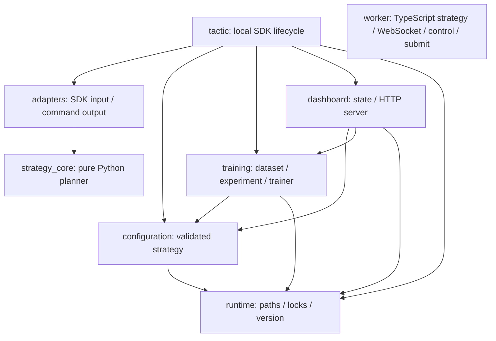

# 项目结构

## 代码依赖方向



依赖保持单向：`strategy_core/` 不导入 SDK、网络、文件、控制台或训练模块；本地 `tactic/engine.py` 通过 `adapters/` 组合官方 SDK 生命周期；Cloudflare 的 TypeScript Worker 自己负责策略、WebSocket、状态、校验和提交。

## Python 包

| 目录 | 责任 | 主要模块 |
|---|---|---|
| `arena_hero_tactic/strategy_core/` | 无 SDK/I/O 的权威 Python 计划、契约、记忆与序列化 | `planner.py`, `model.py`, `serialization.py` |
| `arena_hero_tactic/adapters/` | 官方 SDK Turn 输入转换和 CommandPlan 输出应用 | `sdk_input.py`, `sdk_output.py` |
| `arena_hero_tactic/tactic/` | 官方 SDK 连接、兼容性、控制与本地生命周期 | `engine.py` |
| `arena_hero_tactic/configuration/` | 配置模型、校验、默认值、热加载 | `strategy.py` |
| `arena_hero_tactic/training/` | 匿名记录、数据包、实验和训练 | `dataset.py`, `experiment.py`, `peace_economy.py` |
| `arena_hero_tactic/dashboard/` | 状态投影和本地 HTTP API | `state.py`, `server.py` |
| `arena_hero_tactic/runtime/` | 项目路径、进程锁、版本保护 | `paths.py`, `process_lock.py`, `version_monitor.py` |

项目根目录中的六个旧入口是兼容别名；包根目录不再保留代理模块。新代码应导入上表中的规范模块，例如：

```python
from arena_hero_tactic.configuration.strategy import load_strategy_config
from arena_hero_tactic.training.dataset import export_dataset
```

## 非 Python 目录

| 目录 | 责任 |
|---|---|
| `config/` | 可提交的默认策略和实验计划 |
| `dashboard/` | 浏览器端静态资源 |
| `data/` | 本地运行/训练数据和公开模型 |
| `scripts/` | 安装、启动、验证和安全工具 |
| `tests/` | 战术、配置、数据、运行保护与契约测试 |
| `deploy/` | Docker Compose 与 systemd 长期运行资料 |
| `fixtures/` | Python 与 TypeScript 共用的版本化策略金色夹具 |
| `worker/` | Cloudflare TypeScript 兼容层、控制台和部署配置 |
| `.github/` | CI 和依赖更新配置 |

## 文件归属规则

1. 新战术选择逻辑只能放入 `strategy_core/` 或对应 Worker 策略模块，不得在 SDK 适配器或命令提交入口复制决策。
2. 新配置字段先加入共享策略配置模型、默认值和严格校验，再同步跨语言契约和夹具。
3. 原始样本只写入 `data/training/`；可提交结果必须是 `data/models/` 中的匿名聚合。
4. PID、日志、快照和本地覆盖只写入 `data/runtime/`。
6. 根目录只保留用户入口、仓库元数据和必要的兼容入口，不再堆放实现文件。
