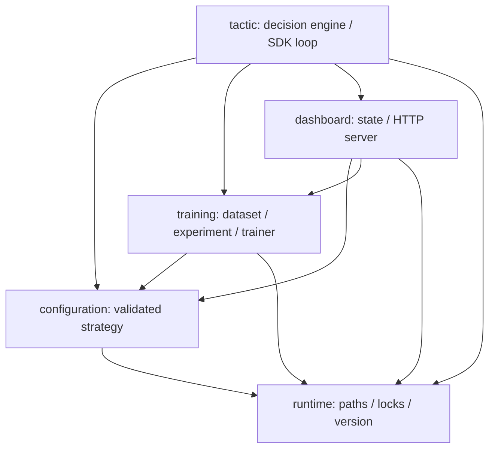

# 项目结构

## 代码依赖方向



依赖保持单向：基础运行层不导入战术，配置层不导入控制台，训练和控制台不负责建立 Arena Hero 连接。只有 `tactic/engine.py` 组合完整运行流程。

## Python 包

| 目录 | 责任 | 主要模块 |
|---|---|---|
| `arena_hero_tactic/tactic/` | 当前 Turn 的决策与官方 SDK 循环 | `engine.py` |
| `arena_hero_tactic/configuration/` | 配置模型、校验、默认值、热加载 | `strategy.py` |
| `arena_hero_tactic/training/` | 匿名记录、数据包、实验和训练 | `dataset.py`, `experiment.py`, `peace_economy.py` |
| `arena_hero_tactic/dashboard/` | 状态投影和本地 HTTP API | `state.py`, `server.py` |
| `arena_hero_tactic/runtime/` | 项目路径、进程锁、版本保护 | `paths.py`, `process_lock.py`, `version_monitor.py` |

项目根目录中的六个旧入口是兼容别名；包根目录不再保留代理模块。新代码应导入上表中的规范模块，例如：

```python
from arena_hero_tactic.configuration.strategy import load_strategy_config
from arena_hero_tactic.training.dataset import export_dataset
```

## 非 Python 目录

| 目录 | 责任 |
|---|---|
| `config/` | 可提交的默认策略和实验计划 |
| `dashboard/` | 浏览器端静态资源 |
| `data/` | 本地运行/训练数据和公开模型 |
| `scripts/` | 安装、启动、验证和安全工具 |
| `tests/` | 战术、配置、数据、运行保护与契约测试 |
| `deploy/` | Docker Compose 与 systemd 长期运行资料 |
| `.github/` | CI 和依赖更新配置 |

## 文件归属规则

1. 新战术选择逻辑放入 `tactic/`，不得在启动脚本复制决策。
2. 新配置字段先加入 `configuration/strategy.py` 的模型、默认值和校验，再接控制台。
3. 原始样本只写入 `data/training/`；可提交结果必须是 `data/models/` 中的匿名聚合。
4. PID、日志、快照和本地覆盖只写入 `data/runtime/`。
5. 根目录只保留用户入口、仓库元数据和必要的兼容入口，不再堆放实现文件。